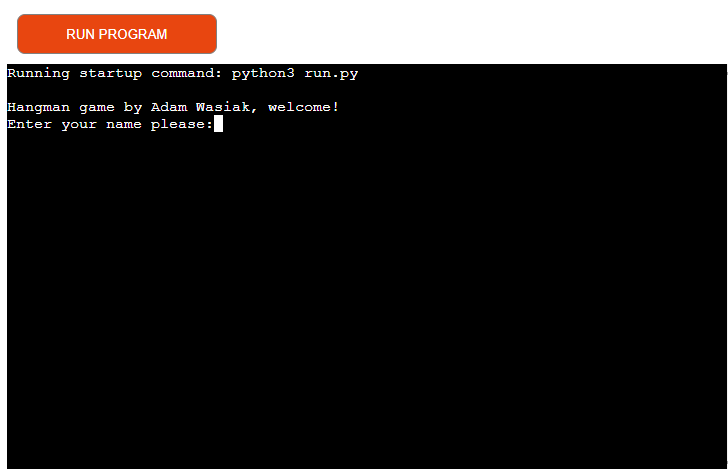
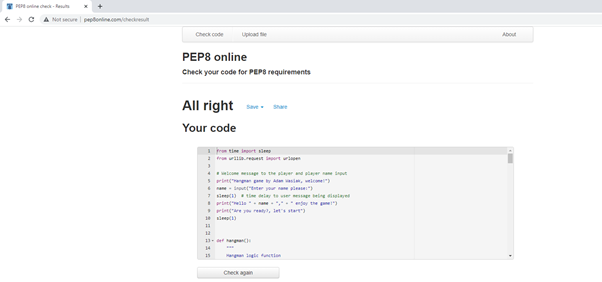

# The Hangman Game by Adam Wasiak
Simple hangman game with unlimited random word selection.
Quick and simple entertainment.

Please visit the following [link](https://thehangmangame2022.herokuapp.com/) to access the game.

## Milestone Project 3
### Purpose 

This simple game was created for the purpose of completing the second Milestone Project for the Code Institute's Diploma in Software Development (E-commerce Applications). The logic for the game was built using the knowledge gained from Python module content of the course. The target audience for this website are users who would like to avail of quick, simple game of Hangman. 

## Game design 
 

-**Concept**- the key concept of the game is to get the user to guess a randomly selected word of a random length. The logic is built using Python languague and incorporates       functions, loop and random selection of words using external resource. The game does not use any exnhanced graphical libraries but rather uses keyboard characters to visualise   hangman.

-**Rules** - each user has 5 attempts to select letters, which make up the randomly selected word. If the user's choice is correct letter will be revealed in the selected word. 
 Should the user's choice not be correct a drawing will progress illustrating a hanman. 
 The game is won by the user once all the letters are guessed correctly. The user loses the game once the user runs out of the 5 attempts and the full drawing of the hangman
 is completed. 

## Features 

## Future developments

Some of the key future developments are as follows:

1. Extend the user input validation to capature non alphabetical characters such as numbers or any other characters.
2. In order to enhance user experience a graphical additions to make the game more entertaining will need to be considered. These could include some static graphics around the      play terminal.
3. In order to attract new users or to retain exisiting users a user selection could be introduced. This is a user can select what thyme they would like to get the words created    for. This would certainly make the experience a lot more entertaining for the end user.

## Testing 
Throughout the course of testing the following key test areas were focused on:

**Functional**

In terms of functional testing the following steps have been taken:

1. **User input** - it has been tested that a user can submit an input successfully for both they own name and also submission of selected letters to guess the word. Completed      successfully.
2. **User input validation** - it has been validated that user submitting no character at all, will return respective message back to the user that valid input is required.
   In addition it was also validated that user submitting the same letter again, will provide respective message to the user advising that a letter has previously been selected.
   Completed successfully.
3. **Visual aspects** -  it has been also reviewed and validated that each incorrect guess by a user will add addtional step to creating a simple drawing to reflect a hanging      man. Completed successfully.
4. **Game replay** - after losing or winning a game, the user will be given a selection to either play the game again or to terminate playing. As part of the testing it has been    validated that the replay function works correct and appropriate user messages are displayed. Completed successfully.
5. **Word random selection** - testing has been completed to ensure that each time a new and a random word is generated and obtained from external resource linked to this          project. Completed successfully.

**Code validator testing**

The code itself has been validated through PEP8 validator available at http://pep8online.com/
The result of code testing has not detected any error or issues requiring an immediate attention.

**Bugs**

  **Fixed Bugs**
  
  - at some stage of development it was identified that user input validation, specifically when user select the same letter again, was not functoning correctly. This has been       subsequently resolved through code correction.
  - it was also identified that a space in front of underscore (representing each letter of the word) was causing a distorted view for the user as to what the actual length of       the word. This was resolved by removing a space in front of underscore character to correct visibility of the letter placeholders.
   
  
  **Unfixed Bugs**
  
  - at the time of the deployment of the project the validation of the user input, whereby the user includes numeric value, still remains unresolved due to time constraints.
  
  
  

 
## Deployment 

The site was deployed to Heroku pages using the following steps:

1. Sign up and Login to Heroku
2. Click on the "NEW APPLICATION" and create an App name and choose your region (Europe for this project)
3. Click on "Deploy" and choose your deployment method
4. If you are connecting with Github choose your main branch and find your repository
5. Add config vars PORT = 8000 and buildpacks python and nodejs
6. Click on deploy manually or automatically (automaticlaly for this project)
7. When selecting Automatic deploayment, Deploy Branch still needs to be selected also.
8. The project has now been deployed
9. When deployed click on View on the bottom of the page

## Credits

1. Credit to creator of the random word selector. This external source is used for random selection of words for this game.
   https://random-word-api.herokuapp.com/word?number=1
2. The project has been inspired by a number of external projects available on the web. Number of external projects have been reviewed as part of my investigation into suitable    approach for my project.
3. Thanky you to Code Institute for excellent module content, Code Institue support team and my mentor Daisy for guidance and support.

